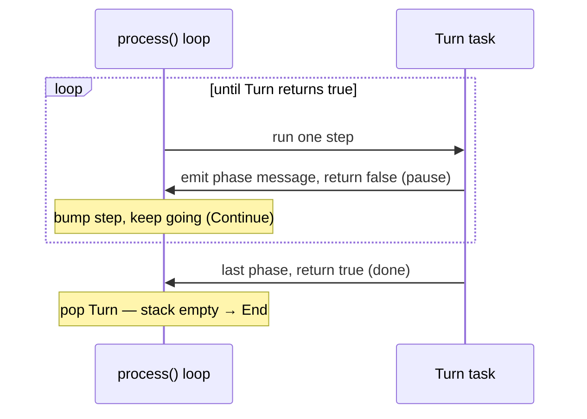

# Turn Flow: the phase clock

How a turn advances. A `Turn` is one resumable task on the processor stack; its
`step` counter **is** the phase clock — one phase per step.

---

## The phases, in order

```
Draw → Standby → Main 1 → Battle → Main 2 → End
```

Each phase is a natural pause point: a place where, later, effects can respond or
the player can act. For now each phase just announces itself with a message.

---

## Step → phase mapping

The `Turn` task runs one phase per `step`, pausing (`false`) between them so the
loop can do other work, and finishing (`true`) on the last phase:

| `step` | Emits | Returns |
|--------|-------|---------|
| 0 | `MSG_NEW_TURN` | `false` (pause) |
| 1 | `MSG_PHASE_DRAW` | `false` |
| 2 | `MSG_PHASE_STANDBY` | `false` |
| 3 | `MSG_PHASE_MAIN1` | `false` |
| 4 | `MSG_PHASE_BATTLE` | `false` |
| 5 | `MSG_PHASE_MAIN2` | `false` |
| 6 | `MSG_PHASE_END` | `true` (done) |

`Turn` never needs a human answer, so pausing just loops (`Continue`) — it does
not freeze the duel.

---

## What the driver does



---

## The message trace (from boot)

Booting queues `Startup`, which hands off to `Turn`. A full run produces:

```
MSG_STARTUP
MSG_NEW_TURN
MSG_PHASE_DRAW
MSG_PHASE_STANDBY
MSG_PHASE_MAIN1
MSG_PHASE_BATTLE
MSG_PHASE_MAIN2
MSG_PHASE_END
```

That exact sequence is asserted in `tests/test_processor.rs`.

---

## Not yet (later red tests)

- **Player handover** — after End, flip to the other player and start a new turn.
  Careful: naïve handover loops forever, since nothing ends the game yet.
- **Real phase actions** — Draw actually draws; Main phases open the action menu;
  Battle declares attacks.
- **Phase skipping** — e.g. no Battle Phase on the very first turn.
