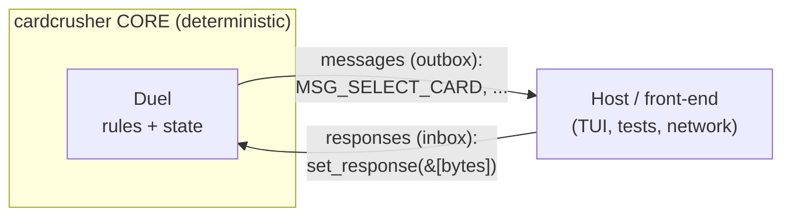

# The Big Picture

**What this chapter covers:** what cardcrusher *is*, the client/server mental model that shapes everything, the 5 determinism rules (and why), and a one-line map of every module.

**Mental model:** a card-game *referee* — it knows the rules, knows nothing about specific cards, and answers one question at a time.

---

## What cardcrusher is

- A **Yu-Gi-Oh! rules engine**, written from scratch in **Rust**.
- Cards aren't Rust — each is a tiny **Lua script** run through the `mlua` crate. One card per file in `cards/*.lua`.
- A **learning reimagining** of EDOPro's `ygopro-core` (the real C++ engine). We mirror its behavior, not its code.
- **Headless-first:** the engine has *no UI*. It's a library. A terminal demo (`examples/play.rs`) is just one possible front-end.

> The one big idea (from `src/lib.rs:5`): *the engine knows the rules but knows nothing about any specific card.* A card is a script that says "hey referee, do X." That's how one engine supports thousands of cards without changing.

---

## The layered mental model: core emits messages, consumes responses

The engine is a **deterministic core** that talks to the outside world through two tiny buffers — the *exact same protocol* a real networked front-end would use.



- The core **emits messages** — "I need a card picked" (`MSG_SELECT_*`), "new turn", etc. These are just bytes in an outbox.
- The host **sends responses** — the player's answer, as raw bytes in an inbox.
- The core never calls the UI. It freezes, waits, and resumes. See `messages()` / `set_response()` in `src/duel/driver.rs:14`.

Why this matters: because the *only* thing crossing the boundary is bytes, the same core runs a local hotseat game, a replay, or a lockstep online match — nothing else has to change.

The turn-by-turn machinery behind this (the processor stack, `step`/`process`, freezing on `needs_answer`) is Chapter 2.

---

## The SACRED RULES: determinism

**The promise (`src/lib.rs:13`):** same seed + same player choices → the *exact same game*, byte for byte, forever.

**Why you can't bolt it on later:** if two players' machines disagree by even one bit, the game **desyncs**. So it's baked into every file. Five rules, no exceptions:

| # | Rule | Why it matters |
|---|------|----------------|
| 1 | **One dice bag** — all randomness from ONE seeded PRNG (`Xoshiro256StarStar`). Never `rand::random()`, never seed from the clock. | Same seed → same shuffles → **reproducible replays**. |
| 2 | **Integers only** in game logic. No floats. | Floats round *differently* on different CPUs → desync. LP/ATK are whole numbers anyway. |
| 3 | **Sort, THEN loop.** If loop order could change the outcome, sort by a stable key (usually an id) first. | Unsorted iteration can differ per run → different game. |
| 4 | **IDs, not pointers.** Objects find each other by id number, never memory address. | Addresses are random per run; ids are stable. Also dodges use-after-free (see `src/ids.rs`). |
| 5 | **Ordered maps only** — `BTreeMap`/`BTreeSet` or a sorted `Vec`. **Never** `HashMap`/`HashSet`. | Hash order can shuffle between runs and *silently* change the game. |

> Rule of thumb (`src/lib.rs:35`): if you're about to type `HashMap`, stop. Use `BTreeMap`.

**One more, Lua-specific:** the Lua VM has its **garbage collector stopped**.

```rust
// src/duel/mod.rs:115
let vm = Lua::new();
vm.gc_stop(); // determinism: no nondeterministic GC pauses
```

Why: a GC pass can run at unpredictable moments and (in some VMs) reorder things. Stopping it keeps card scripts byte-identical across runs. This is what makes **replays and lockstep networking** possible at all.

You can see the rules honored in the `Duel` struct itself — e.g. `card_data` is a `BTreeMap`, chosen explicitly "for deterministic iteration" (`src/duel/mod.rs:76`).

---

## The module map (one line each)

The crate is a house; each module is a room (`src/lib.rs:39`).

**The `duel/` package — the game itself, split for size (all children see the private fields):**

| Module | One-liner |
|--------|-----------|
| `duel/mod.rs` | The `Duel` struct + Lua VM setup (`new`, `set_globals`, `load_prelude`). Owns everything. |
| `duel/board.rs` | The arena, deck/hand piles, zones, movement, life points, win conditions. |
| `duel/driver.rs` | The **loop**: player I/O buffers, turn control, `process`/`step`/`run_unit`. |
| `duel/scripting.rs` | Loading cards and running their Lua effect stages ("describe, then execute"). |
| `duel/battle.rs` | The battle-phase flow (attacks, damage) — its own chapter. |
| `duel/prelude/*.lua` | The card **DSL**: base classes + verbs + constant tables, baked into the binary. |

**Top-level modules:**

| Module | One-liner |
|--------|-----------|
| `effect.rs` | The `EffectContext` scratchpad + the Rust "verbs" (`destroy`, `pay_lp`, `targets`) that Lua calls; `EffectKind`/`CostType`. |
| `card.rs` | One card *instance* on the board; its stats come from `CardData` (the static, script-harvested definition). |
| `field.rs` | The tabletop: a card→`(controller, zone)` map plus per-player ordered piles. |
| `chain.rs` | A `ChainLink` — one activated effect waiting to resolve (effect + card + activator + targets). |
| `event.rs` | Game events (`EVENT_DESTROYED`, damage-calc windows, …) that triggers subscribe to. |
| `modifiers.rs` | A `Modifier` instance — a change layered onto a card/player (ATK change, no-battle-damage, …). |
| `processor.rs` | The `Processor` enum (the to-do stack's task types) + `DuelStatus` + `needs_answer`. |
| `group.rs` | An ordered bundle of cards (`BTreeSet<CardId>`) — "every monster on the field". |
| `ids.rs` | The coat-check tickets (`CardId` etc.) — generational ids into a `SlotMap`. |
| `zone.rs` | The `Zone` enum (Deck/Hand/MonsterZone/SpellTrapZone/GY/Banishment). |
| `position.rs` | A monster's battle position (face-up/down × attack/defense). |
| `reason.rs` | Why a card moved — a `REASON_*` bitmask (destroy, battle, effect, …). |
| `constants.rs` | Shared constants: player indices, `MSG_*` outbox codes, menu commands. |
| `cards/*.lua` | Real cards, one self-registering script each (Kuriboh, PotOfGreed, …). |

---

## In one breath

- **cardcrusher = a headless YGO referee.** Rules in Rust, cards in Lua.
- It talks to the world through **messages out, responses in** — the same protocol whether local, replay, or online.
- **Determinism is law:** one PRNG, integers, sort-before-loop, ids-not-pointers, ordered maps, GC off. Break one → desync.
- The `Duel` god object (Chapter 2) drives it all via a resumable processor stack.
