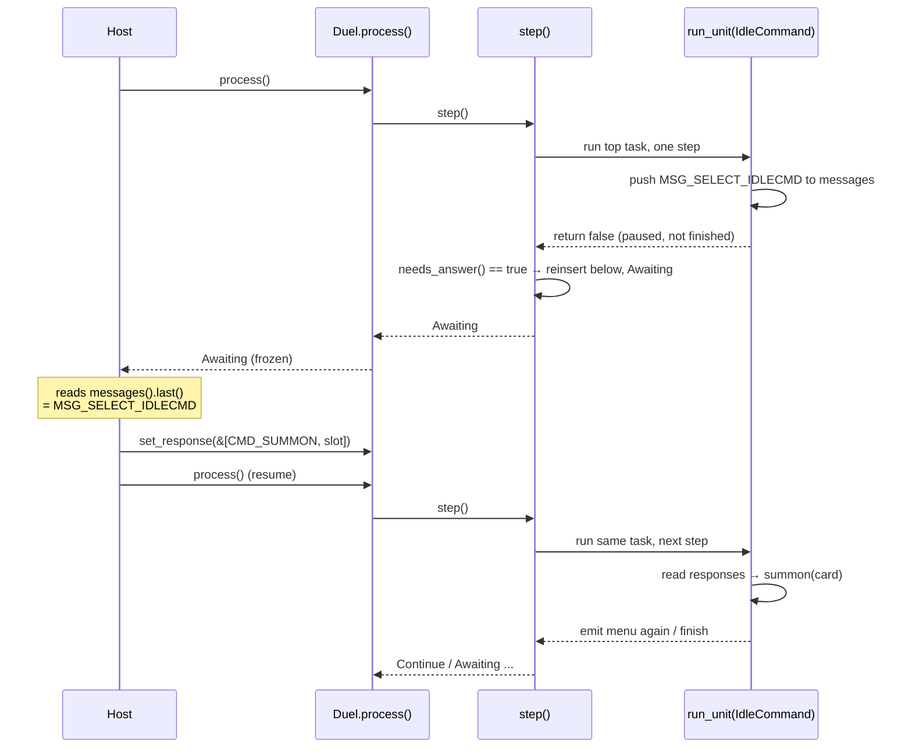

# The Duel & The Processor Loop

**What this chapter covers:** the `Duel` god object and its "no back-links, look up by id" rule, then the processor stack machine — `step`/`process`, the LIFO push order, the messages/responses buffers, and how `step()` freezes to ask a human.

**Mental model:** the game is a **stack of sticky notes**, each a job that remembers how far along it is. The engine runs the top note one step, then keeps it or throws it away.

---

## The `Duel` god object owns everything

`Duel` is the box that owns every other room: the card arena, the board, the processor stack, the I/O buffers, the Lua VM, and game state (LP, win result). See `src/duel/mod.rs:37`.

**The design rule (`src/duel/mod.rs:5`):** *no object holds a link back to the `Duel`.*

- Code that needs the game takes **`&mut Duel`** and looks things up **by id**.
- The motto: **grab a ticket, look it up, do one small thing, let go.**
- Why: Rust's borrow checker forbids a web of objects all pointing back at their owner. A flat "owner + tickets" shape sidesteps that entirely.

Dry run of the motto — summoning a card from hand slot `slot`:

```rust
// src/duel/driver.rs:204  (inside IdleCommand → CMD_SUMMON)
let card = self.field.borrow().hand_card(*player, slot); // grab the ticket (a CardId)
if let Some(card) = card {
    if self.can_normal_summon(*player) {
        self.summon(card);                 // do one small thing, by id
        self.record_normal_summon(*player);
    }
}
```

Note the comment there: bind `card` *first* so the `field` borrow drops before `summon` takes `borrow_mut()`. That's the rule in miniature.

### The shared `Rc<RefCell<..>>` fields

Most of `Duel` is plain owned data. But **four fields are shared handles** — `Rc<RefCell<T>>`:

```
Duel
 ├─ field:      Rc<RefCell<Field>>              ← the board
 ├─ effects:    Rc<RefCell<Vec<(u32, Table)>>>  ← every registered Lua effect
 ├─ card_data:  Rc<RefCell<BTreeMap<u32,CardData>>> ← static card stats
 └─ effect_ctx: Rc<RefCell<EffectContext>>      ← the effect scratchpad
```

**Why shared?** The **Lua layer must read them live.** When the duel is built (`src/duel/mod.rs:118`), *clones of these same handles* are handed to the Lua VM's registered functions:

```rust
// src/duel/mod.rs:118
Self::set_globals(
    &vm,
    effects.clone(),     // same data, second handle
    card_data.clone(),
    effect_ctx.clone(),
    field.clone(),
)
```

- A Lua verb like `e:destroy(...)` can't touch `Duel` directly — that would be a borrow cycle (`src/duel/mod.rs:69`).
- Instead it holds an `Rc` clone of `effect_ctx` and **records** its intent there.
- After the Lua stage runs, the `Duel` reads the scratchpad and applies it ("describe, then execute").

`Rc` = shared ownership; `RefCell` = borrow-checked at *runtime* instead of compile time. Together: two owners (the Duel and the Lua closure) can safely touch one piece of state.

---

## The processor stack machine

The heartbeat is one field:

```rust
// src/duel/mod.rs:49
processor_stack: Vec<Processor>,   // the resumable to-do stack
```

- A `Processor` is one **task in progress** — `Turn`, `IdleCommand`, `Activate`, `Attack`, … (full list in `src/processor.rs:31`).
- Every variant carries a **`step`** counter — *how far along it is*. That's what makes it resumable.

**Why a stack of steps instead of normal function calls?** (`src/processor.rs:20`) The engine must **freeze mid-job** to ask a human "which card?" and thaw later *exactly* where it left off. A paused note on a stack can do that; a half-finished function call on the native call stack cannot.

### `step()` vs `process()`

```rust
// src/duel/driver.rs:57
pub fn process(&mut self) -> DuelStatus {
    loop {
        match self.step() {
            DuelStatus::Continue => continue,
            other => return other,     // Awaiting or End
        }
    }
}
```

- **`step()`** runs the **top** task for **one** step.
- **`process()`** just loops `step()` until it can't continue.

Both return a **`DuelStatus`** (`src/processor.rs:84`) — three outcomes:

| Status | Meaning | `process()` does |
|--------|---------|------------------|
| `Continue` | Did a step, more work remains. | Loop again. |
| `Awaiting` | A task froze — **needs a human**. | Stop, return. Host must `set_response`. |
| `End` | Stack drained or game decided. | Stop, return. Game over. |

---

## Messages out, responses in

Two buffers on `Duel` are the *entire* conversation with the host:

```rust
// src/duel/mod.rs:45
messages: Vec<DuelMessage>,   // Outbox — what the engine emitted
responses: Vec<u8>,           // Inbox  — the host's most recent answer
```

The API (`src/duel/driver.rs:14`):

```rust
pub fn messages(&self) -> &[DuelMessage] { &self.messages }   // read the outbox

pub fn set_response(&mut self, response: &[u8]) {             // write the inbox
    self.responses.clear();
    self.responses.extend_from_slice(response);
}
```

- A task emits by **pushing a `MSG_*`** onto `messages` (e.g. `self.messages.push(MSG_SELECT_IDLECMD)`).
- The host reads `duel.messages().last()` to see the prompt, then calls `set_response(&[cmd, index])`.
- Next `step()`, the task reads `self.responses` and acts on it.

Responses are **just bytes**. The Main-Phase menu, for instance, reads `responses[0]` as a command and `responses[1]` as an index (`src/duel/driver.rs:195`).

---

## The LIFO rule: push in *reverse* of run order

`processor_stack` is a `Vec` used as a stack — **last pushed, first run.** So when a task queues several sub-tasks, it pushes them in the **reverse** of the order you want them to run.

Look at `Activate` finishing an effect (`src/duel/driver.rs:263`):

```rust
self.processor_stack.push(Processor::IdleCommand { step: 0, player: *player });
self.processor_stack.push(Processor::ResolveChain { step: 0 });
self.processor_stack.push(Processor::ChainResponse { step: 0, player: 1 - *player });
```

**Intended run order:** ChainResponse (opponent may respond) → ResolveChain (settle the chain) → IdleCommand (back to your menu). Pushed in the *opposite* order, so the stack pops them correctly:

```
push IdleCommand      stack: [.., IdleCommand]
push ResolveChain     stack: [.., IdleCommand, ResolveChain]
push ChainResponse    stack: [.., IdleCommand, ResolveChain, ChainResponse]
                                                              ^ pops FIRST
```

---

## `needs_answer()` — freeze or keep going?

When a task **pauses** (returns "not finished this step"), `step()` must decide: keep the loop running, or **stop and wait for a human?** That's `needs_answer()` (`src/processor.rs:93`):

```rust
pub fn needs_answer(&self) -> bool {
    match self {
        Processor::Startup { .. } | Processor::Turn { .. } => false,  // internal book-keeping
        Processor::SelectCard { .. } => true,     // "pick a card" → wait
        Processor::IdleCommand { .. } => true,    // menu → wait
        Processor::BattleCommand { .. } => true,
        Processor::Attack { .. } => true,
        // ... most human-facing tasks → true
        Processor::ResolveChain { .. } => false,  // pure engine work
        Processor::ChainResponse { .. } => true,
    }
}
```

- `true` → pausing here means a human must answer → `step()` returns **`Awaiting`**.
- `false` → the pause was just an internal beat (e.g. `Turn` advancing a phase) → `step()` returns **`Continue`** and the loop rolls on.

### The reinsert-below-children trick

Here's the whole `step()` (`src/duel/driver.rs:67`):

```rust
pub fn step(&mut self) -> DuelStatus {
    if self.result.is_some() { return DuelStatus::End; }   // decided game

    let mut unit = match self.processor_stack.pop() {      // take the top note
        Some(unit) => unit,
        None => return DuelStatus::End,                    // nothing left → over
    };
    let depth_before = self.processor_stack.len();          // remember the water line

    let unit_run = self.run_unit(&mut unit);                // do ONE step
    self.process_events();
    if unit_run {
        DuelStatus::Continue                                // finished → drop the note
    } else {
        // Paused: put it back — but BELOW anything it just queued,
        // so those children run FIRST.
        let is_freeze = unit.needs_answer();
        self.processor_stack.insert(depth_before, unit);
        match is_freeze {
            true  => DuelStatus::Awaiting,                  // needs a human → freeze
            false => DuelStatus::Continue,
        }
    }
}
```

**Why pop-then-reinsert-below (not leave it on top)?** A paused task often *queues children on this same step*. Those children must run **before** the parent's next step. So:

1. `pop` the parent off (this also frees the stack borrow so `run_unit` can push through `&mut self` — see the comment at `driver.rs:74`).
2. Record `depth_before` = the stack height *before* `run_unit`.
3. `run_unit` may push children on top.
4. If the parent paused, `insert` it back at `depth_before` — i.e. **underneath** the children.

**Dry run** — a `Turn` reaching Main Phase 1 (`run_unit` for `Turn`, `src/duel/driver.rs:139`):

```
start          stack: [Turn(step=3)]              ← pop Turn, depth_before = 0
run_unit       Turn pushes IdleCommand, returns false (paused)
after run_unit stack: [IdleCommand]               ← child is on top
insert @0      stack: [Turn(step=4), IdleCommand] ← parent slid UNDER the child
                       ^ underneath      ^ pops first
needs_answer?  Turn → false → Continue
next step()    pops IdleCommand → emits MSG_SELECT_IDLECMD, needs_answer → Awaiting
```

The `Turn` note keeps its place, but the menu runs first. Exactly what we want.

---

## One full prompt cycle

Putting it together — the engine emits a prompt, freezes, the host answers, it resumes:



- **Emit:** `run_unit` pushes a `MSG_*` and returns `false`.
- **Freeze:** `step()` sees `needs_answer()` and returns `Awaiting`; `process()` stops.
- **Answer:** host reads `messages().last()`, calls `set_response(&[..])`.
- **Resume:** host calls `process()` again; the same task pops, reads `responses`, and continues from its `step`.

---

## In one breath

- **`Duel` owns everything;** nothing points back. Take `&mut Duel`, look up by id.
- **Four `Rc<RefCell<..>>` fields** (field, effects, card_data, effect_ctx) are shared so **Lua can read them live**.
- **`processor_stack`** is a stack of resumable notes. **`step()`** runs the top one once; **`process()`** loops until `Awaiting` or `End`.
- Queue children by pushing in **reverse run order** (LIFO). A paused parent slides **under** its children so they go first.
- **`needs_answer()`** decides freeze (`Awaiting`) vs roll-on (`Continue`). The conversation is just **messages out, responses in**.

> Forward pointers: what a `SelectCard` actually offers (zones/cards), how a Lua effect stage yields mid-run, and how chains resolve are their own chapters.
