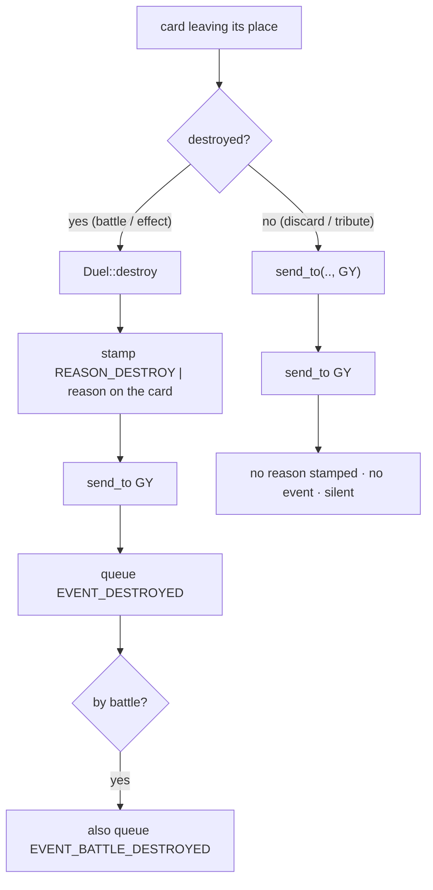

# Cards, Zones & Movement

**What this chapter covers:** how a card is stored (a ticket, not a pointer), the split between an instance and its printed record, where cards physically sit (the `Field`), and the moves between zones — with the crucial `destroy` vs `send` split.

**Mental model:** a coat-check room. Every card is an item in the room; you hold a tiny numbered *ticket*, never the item itself.

---

## 1. `CardId` — a ticket, not a pointer

- A `CardId` is a key into a `slotmap::SlotMap` (the "coat-check room") — see `src/ids.rs:32`.
- **It is not a pointer.** Nobody holds the card's memory address; they hold a small copyable number.
- Every cross-reference between objects uses a ticket: "the card I'm equipped to" is a `CardId`, not a `&Card` (`src/card.rs:11`).

**Why tickets?** So a dead reference can't read a live-but-different card.

### The clever part: generations

Each ticket carries a **generation** number. Reuse a freed slot and its generation bumps, so old tickets stop matching (`src/ids.rs:11`).

```text
let a = cards.insert(card);   // a = "slot 5, gen 1"
cards.remove(a);              // slot 5 now empty
let b = cards.insert(card);   // b = "slot 5, gen 2"  (slot reused!)

cards.get(a)  // => None     ✅ old ticket is dead — safe, never a crash
cards.get(b)  // => Some(..)  ✅ new ticket works
```

That "old ticket → `None`" is a use-after-free guard we get for free — a stale id can never alias a new card.

The arena itself lives on the `Duel`: `cards: SlotMap<CardId, Card>` (`src/duel/mod.rs:39`).

---

## 2. `Card` (the instance) vs `CardData` (the printed record)

Two separate things, on purpose.

| | `CardData` | `Card` |
|---|---|---|
| What | The **printed** card — same for every copy | **One physical copy** on the table |
| Keyed by | `code` (the passcode) | a `CardId` ticket |
| Holds | type, atk, def, level, attribute, race, name, text | code, a *copy* of its `CardData`, position, owner, reason, modifiers |
| Source | harvested from the Lua script | built at runtime by `make_card` |
| Defined | `src/card.rs:26` | `src/card.rs:50` |

### `CardData` — the static definition

- `card_type`, `attribute`, `race` are **bitmasks** (`TYPE_MONSTER | TYPE_EFFECT`, etc.) — `src/card.rs:26`.
- `atk`/`def` are **signed** (`i32`) so "?" can be `-2` later.
- `level` and the subtype fields are `Option` — `None` for cards that don't have them (a Spell has no level; a monster has no `spell_type`) — `src/card.rs:30`.

### `Card` — the instance

The instance adds things that only make sense for *this copy on the board* (`src/card.rs:50`):

- `owner` — whose deck it belongs to. **Fixed for life.** (Control can differ — that lives on the `Field`.)
- `position` — battle position; only meaningful in a Monster Zone.
- `reason` — a `REASON_*` bitmask: *why* it most recently left its place. Stamped by `destroy` (see §5).
- `modifiers` — live stat changes (covered in the modifiers chapter).

### How the printed record gets onto the instance

Two steps, at two different times.

**Load time** — the card's Lua runs, calls `register_card(code, data)`, and the Rust hook harvests the table into a `CardData`, keyed by code (`src/duel/mod.rs:177`). Absent fields default to `0`/`""`/`None`.

**Runtime** — `make_card(code)` looks that record up and *stamps a clone* onto a fresh instance (`src/duel/board.rs:27`):

```rust
pub fn make_card(&self, code: u32) -> Card {
    let data = self.card_data.borrow().get(&code).cloned().unwrap_or_default();
    Card::with_data(code, data)   // code never loaded → all-zero bare card
}
```

**Dry run:** load `PotOfGreed.lua` → `card_data[55144522] = { type: SPELL, name: "Pot of Greed", … }`. Later `make_card(55144522)` → a new `Card` carrying its own copy of those numbers.

---

## 3. The `Field` — where cards physically sit

Two views of "location", because they answer different questions (`src/field.rs:17`):

```text
Field
├── locations : BTreeMap<CardId, (controller, Zone)>   ← "where is card X?"
├── decks     : [Vec<CardId>; 2]                        ← "top card of P0's deck?"
└── hands     : [Vec<CardId>; 2]                        ← ordered hand per player
```

- `locations` — one entry per card: **who controls it** + **which kind of zone**. One lookup answers "where is this card" for *any* zone (`src/field.rs:20`).
- `decks` / `hands` — **ordered** piles, one per player.

### Why zones don't need ordered `Vec`s but hand/deck do

- **Deck:** order *is* the game — "draw the top card" only means something if there's a top. `draw` pops off the end (`src/field.rs:97`).
- **Hand:** you pick "card #2 in hand" by slot, so slots must be stable.
- **Monster / Spell-Trap / GY:** the engine treats these as an unordered set — "the monsters P0 controls" is just a filter over `locations`, returned in **id order** for determinism (`cards_in`, `src/field.rs:130`).

> `controller` here is who *controls* the card now — not always its `owner`. Control can move (e.g. Change of Heart) without ownership. Ownership stays on the `Card`.

### Controller vs owner, side by side

- `controller_of(card)` → reads `locations` (`src/field.rs:45`).
- `owner_of(card)` → reads `card.owner` (`src/duel/board.rs:184`).
- They're equal today, but the split is already wired so control-changing effects don't need a refactor.

### The `Zone` enum and the Lua bridge

`Zone` is a plain enum: `Deck, Hand, MonsterZone, SpellTrapZone, GY, Banishment` (`src/zone.rs:1`).

Lua can't hold a Rust enum, so it passes an integer `ZONE_*` code. `Zone::from_code` is the bridge (`src/zone.rs:14`); the numbers match `prelude/zones.lua`:

```text
ZONE_DECK 0   ZONE_HAND 1   ZONE_MONSTER 2
ZONE_SPELLTRAP 3   ZONE_GY 4   ZONE_BANISHMENT 5
```

So a card writing `e:send(targets, ZONE_HAND)` sends `1` across; `from_code(1)` turns it back into `Zone::Hand`.

---

## 4. Movement primitives: `place` and `send_to`

### `place` — record a location, no bookkeeping

`place(player, card, zone)` just writes the `locations` entry (`src/field.rs:35`). Used when a card first enters play.

### `send_to` — a plain relocation

`send_to(card, zone)` moves a card and keeps its current controller (`src/field.rs:57`). It does the pile bookkeeping so counts stay correct:

1. **Leave** the old ordered pile (if it was in deck/hand) — `remove_from_pile` (`src/field.rs:72`).
2. **Rewrite** its location to the new zone.
3. **Join** the new ordered pile — only if the destination is deck or hand.

```text
Hand[P0]: [A, B, C]         send_to(B, Zone::GY)
                    ──▶ remove B from hand pile
                        locations[B] = (P0, GY)
                        GY has no pile → nothing to join
Hand[P0]: [A, C]   GY[P0]: {B}
```

`send_to` is the shared workhorse. Higher-level moves are thin wrappers over it:

- `summon(card)` → `send_to(.., MonsterZone)` + set face-up attack (`src/duel/board.rs:227`).
- `set_monster` / `set_spell_trap` → `send_to` + position (`src/duel/board.rs:234`, `:287`).

> **Note (a known simplification):** `send_to` keeps the *controller*, but a card leaving the field should really return to its *owner's* side. Fine today because control never diverges from ownership yet (`src/field.rs:54`).

---

## 5. `destroy` vs `send` — the one distinction that matters

**They are not the same move.** In Yu-Gi-Oh!, "destroyed" is a specific fate with triggers attached; "sent to the GY" (discard, tribute) is not.



### `destroy` — the single chokepoint

`destroy(card, reason)` is the **only** path that counts as destruction (`src/duel/board.rs:198`):

```rust
pub fn destroy(&mut self, card: CardId, reason: Reason) {
    if let Some(c) = self.cards.get_mut(card) {
        c.reason = REASON_DESTROY | reason;   // 1. stamp WHY on the card
    }
    self.send_to(card, Zone::GY);             // 2. actually move it
    let by_battle = reason & REASON_BATTLE != 0;
    self.events.push_back(DuelEvent {         // 3. queue EVENT_DESTROYED
        code: EVENT_DESTROYED, card,
        reason: REASON_DESTROY | reason, /* details … */
    });
    if by_battle {
        self.events.push_back(DuelEvent { code: EVENT_BATTLE_DESTROYED, /* … */ });
    }
}
```

Three things a bare move never does:

1. **Stamps a reason** (`REASON_DESTROY | reason`) on the card — "destroyed by battle" triggers later test these bits (`src/reason.rs:12`; `REASON_BATTLE = 0x20`, `REASON_EFFECT = 0x40`).
2. **Queues `EVENT_DESTROYED`** onto the duel's event queue (`EVENT_DESTROYED = 1`, `src/event.rs:5`).
3. **Also queues `EVENT_BATTLE_DESTROYED`** when the reason includes battle (`= 2`, `src/event.rs:6`).

*(Events just get queued here — how they fire triggers is the events chapter.)*

An effect's `e:destroy` verb funnels through this same chokepoint, tagged `REASON_EFFECT` (`handle_destroys`, `src/duel/scripting.rs:430`).

### `send` — a plain relocation, silent

A `send` (the `e:send` verb, or a discard cost) is *just* `send_to` (`src/duel/scripting.rs:441`, `:72`):

- No reason stamped.
- No event queued.
- Not a destruction — no "when destroyed" trigger can ever see it.

That's why a discard cost uses `send_to`, not `destroy` (`apply_cost`, `src/duel/scripting.rs:72`).

### Side by side — same destination, different meaning

**Discard (a plain send):**
```text
Hand[P0]: [Kuriboh]  ── discard cost ──▶  send_to(Kuriboh, GY)
GY[P0]: {Kuriboh}    reason = (unchanged) · events: (none)
```

**Destroy by battle:**
```text
MZONE[P0]: [BeaverWarrior]  ── loses battle ──▶  destroy(Beaver, REASON_BATTLE)
GY[P0]: {BeaverWarrior}     reason = REASON_DESTROY|REASON_BATTLE
events queued: [EVENT_DESTROYED, EVENT_BATTLE_DESTROYED]
```

Both land in the GY. Only the second is a *destruction* — and only it can wake a "when destroyed by battle" trigger.

---

## Recap

- Cards are **tickets** into a generational arena — stale ids fail safely, never alias.
- `CardData` = the printed card (shared); `Card` = one instance (`make_card` stamps a copy).
- The `Field` splits location into a `locations` map + **ordered** deck/hand piles; zones stay unordered.
- `send_to` relocates and fixes pile counts; `destroy` is the **one** path that stamps a reason and queues destruction events.

*Next: how effects run their Lua stages and how verbs like `e:destroy` actually reach these moves — Chapter 4.*
