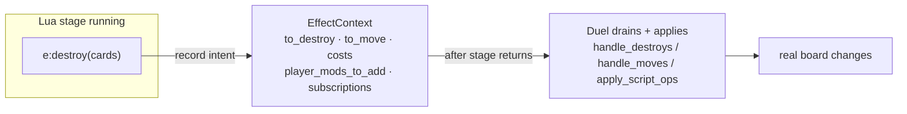
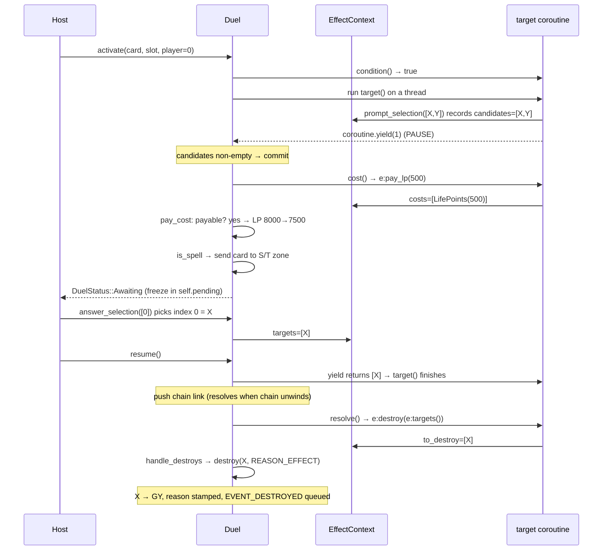

# Scripting: Effects & Verbs

**What this chapter covers:** how one Lua VM inside the `Duel` runs card scripts, the four stages every effect has, the "describe-then-execute" verb pattern that dodges Rust's borrow rules, and the coroutine trick that lets a card pause mid-effect to ask the player.

**Mental model:** the card is a **waiter with a notepad**. It never walks into the kitchen (the `Duel`) itself — it writes the order down, and the kitchen reads the pad afterward.

---

## 1. The Lua bridge: one VM, owned by the `Duel`

- The `Duel` **owns exactly one** `mlua::Lua` VM — `vm: Lua` (`src/duel/mod.rs:71`).
- Its garbage collector is **stopped** at startup: `vm.gc_stop()` (`src/duel/mod.rs:116`) — GC pauses are nondeterministic, and determinism is sacred.
- Everything shared between Rust and Lua lives behind `Rc<RefCell<..>>` so both sides see the same state live: the field, the effect list, the card data, the effect context (`src/duel/mod.rs:109`).

### What loads, in order

`load_prelude` bakes the DSL into the binary with `include_str!` and runs it (`src/duel/mod.rs:202`):

1. **Constant tables** — `players`, `effect_kinds`, `card_types`, `zones`, … (define names like `ACTIVATE`, `TYPE_SPELL`, `ZONE_HAND`).
2. **`base.lua`** last — the `Effect` and `Card` base classes + verb wrappers (`src/duel/prelude/base.lua`).
3. **Cards** later still (`load_card`, `src/duel/scripting.rs:22`) — each relies on all of the above.

### Cards self-register through Rust hooks

A card script *is* its registration. Loading it runs two hooks:

- `Card:new(id, data)` → calls `register_card` → harvests the printed stats into `CardData` (`src/duel/mod.rs:177`).
- `card:add_effect(kind, category)` → calls `register_effect` → pushes the effect's Lua table onto the duel's `effects` list (`src/duel/mod.rs:169`).

```lua
PotOfGreed = Card:new(55144522, {              -- register_card(...)
    type = TYPE_SPELL, spell_type = SPELL_NORMAL,
    name = "Pot of Greed", text = "Draw 2 cards.",
})
local activate = PotOfGreed:add_effect(ACTIVATE, {EFF_CAT_DRAW})  -- register_effect(...)
```

An effect is a plain **Lua table** with method fields — not a Rust struct. That's deliberate: only a Lua function can `coroutine.yield` (see §4).

---

## 2. The four effect stages

Every effect is built on the `Effect` base class, which supplies four default stages a card overrides only as needed (`src/duel/prelude/base.lua:9`):

| Stage | Question it answers | Default |
|---|---|---|
| `condition` | *Can it activate right now?* | `return true` |
| `cost` | *What do you pay?* | pay nothing |
| `target` | *What does it point at?* | no target |
| `resolve` | *What does it do?* | nothing |

Each stage is a Lua method called with the effect table as **both `self` and `e`** — so inside you can call `e:pay_lp(500)` (`src/duel/scripting.rs:43`, `:79`):

```rust
cost_func.call::<()>((effect_table.clone(), effect_table))?;
//                     ^^^^ self            ^^^^ e
```

A full card touching all four (`tests/fixtures/ExampleSpell.lua`):

```lua
function activate:cost(effect)    effect:pay_lp(500) end
function activate:target(effect)  effect:prompt_selection(effect:monster_zone(OPPONENT), 1) end
function activate:resolve(effect) effect:destroy(effect:targets()) end
-- condition: inherited default (always true)
```

---

## 3. Describe-then-execute: verbs write to a scratchpad

**The problem:** a verb like `e:destroy` needs to change the `Duel`. But the `Duel` is *currently running the Lua VM* that called the verb — reaching back into `Duel` from inside would be a borrow cycle (`&mut Duel` while `Duel` is already borrowed to run Lua). Rust forbids it.

**The fix:** verbs never touch the `Duel`. They **record intents** into a shared scratchpad, the `EffectContext` (`src/effect.rs:29`). The `Duel` drains those records **after** the stage returns.



### The scratchpad

`EffectContext` is one shared struct of "to-do" lists + read-only inputs (`src/effect.rs:29`): `to_destroy`, `to_move`, `costs`, `candidates`, `targets`, `activator`, `self_card`, `player_mods_to_add`, `subscriptions_to_add`, …

### A verb, end to end

`register_verbs` installs each verb as a VM global that captures a clone of the shared context (`src/effect.rs:163`). `e:destroy` just appends to a list — it changes nothing on the board:

```rust
// src/effect.rs:174
let destroy = lua.create_function(move |_, ids: Vec<i64>| {
    c.borrow_mut().to_destroy.extend(ids.into_iter().map(decode));
    Ok(())   // recorded, not executed
})?;
```

The prelude wrapper is a one-liner over that global (`src/duel/prelude/base.lua:21`):

```lua
function Effect:destroy(cards) effect_destroy(cards) end
```

### Where the `Duel` drains it

After `resolve` runs, `resolve_effect` reads the pad back and applies it (`src/duel/scripting.rs:76`):

```rust
resolve_func.call::<()>((effect_table.clone(), effect_table))?;
self.handle_destroys();    // drains to_destroy  → Duel::destroy(.., REASON_EFFECT)
self.handle_moves();       // drains to_move     → send_to
self.apply_script_ops();   // drains modifiers + subscriptions
```

- `handle_destroys` (`src/duel/scripting.rs:430`) → each queued card through the real `destroy` chokepoint (stamps reason, queues events — see Chapter 3).
- `handle_moves` (`src/duel/scripting.rs:441`) → each `(card, zone)` through `send_to` (silent relocation).
- `apply_script_ops` (`src/duel/scripting.rs:90`) → player modifiers + event subscriptions onto the `Duel`.

Costs use the same pattern with a twist: `pay_cost` drains `costs`, checks **all** are payable, and commits only then — so a rejected activation pays nothing (`src/duel/scripting.rs:39`).

> **Why this is nice:** stages stay pure "descriptions." The `Duel` decides *when* to apply them (after cost check, after resolve, in the right order), and there's never a borrow conflict.

---

## 4. The coroutine bridge: pausing mid-stage to ask the player

**The problem:** `target` needs the player to pick a card. But the engine is synchronous — it can't block the whole program waiting for a human/network answer.

**The fix:** the `target` stage runs on a **Lua coroutine**. When it needs a pick, it `coroutine.yield`s — freezing the stage exactly where it stands. The host answers later; the engine `resume`s, handing the chosen cards *back into* the paused `yield`, and the Lua continues as if the call had simply returned.

`prompt_selection` is where the magic sits — it's plain Lua, so it can yield (`src/duel/prelude/base.lua:33`):

```lua
function Effect:prompt_selection(candidates, count)
    effect_prompt_selection(candidates)   -- record the candidate set
    return coroutine.yield(count)         -- PAUSE → host answers → resumes here
end
```

To Lua it reads linearly: "ask, get the pick back, use it." Under the hood the whole duel suspended between the two lines.

### Activate: the two branches

`activate` runs `target` on a fresh thread and looks at whether it yielded (`src/duel/scripting.rs:181`):

```rust
let thread = self.vm.create_thread(target_func)?;
thread.resume::<mlua::Value>((effect.clone(), effect))?;

match thread.status() {
    ThreadStatus::Resumable => {          // it yielded → wants a selection
        if self.effect_ctx.borrow().candidates.is_empty() {
            return Ok(DuelStatus::End);   // no legal target → reject, no cost
        }
        if !self.pay_cost(idx, player)? { return Ok(DuelStatus::End); }  // can't pay → reject
        if is_spell { self.send_to(card, Zone::SpellTrapZone); }         // S/T goes to field
        self.pending = Some((thread, idx, card));   // FREEZE the coroutine
        Ok(DuelStatus::Awaiting)                    // "I'm waiting for a pick"
    }
    _ => {                                 // never yielded → nothing to pick
        if !self.pay_cost(idx, player)? { return Ok(DuelStatus::End); }
        if is_spell { self.send_to(card, Zone::SpellTrapZone); }
        let targets = self.effect_ctx.borrow().targets.clone();
        self.push_chain_link(idx, card, player, targets, EventSnapshot::default());
        Ok(DuelStatus::End)                // straight onto the chain
    }
}
```

Key ordering: **cost is paid only once the activation commits** — after "is there a legal target?", never on a rejection.

### Answering and resuming

The frozen coroutine sits in `self.pending`. The host resolves it in two steps:

1. `answer_selection(indices)` — maps the picked *indices* back to `CardId`s (via the recorded `candidates`) and stores them as `targets` (`src/duel/scripting.rs:227`).
2. `resume()` — hands those ids back into the paused `yield`, letting `target` finish, then puts the effect on the chain (`src/duel/scripting.rs:238`):

```rust
let (thread, index, card) = self.pending.take().expect("nothing awaiting");
let chosen = encode_ids(&self.effect_ctx.borrow().targets);
thread.resume::<mlua::Value>(chosen)?;   // yield RETURNS these → Lua continues
// … push the finished effect onto the chain …
```

*(Resolution itself happens when the chain unwinds — `resolve_chain`, `src/duel/scripting.rs:604` — covered in the chain chapter. Here we just note the effect is now on the chain.)*

---

## 5. Worked example: ExampleSpell (cost + target + resolve)

"Pay 500 LP, then destroy 1 monster your opponent controls." This is the full coroutine path — cost, a real selection, and a describe-then-execute resolve.

**Setup:** P0 activates it; P1 controls monsters `[X, Y]`. P0 has 8000 LP.



**State trace:**
```text
start   LP[P0]=8000   P1 MZONE:[X,Y]   card: hand
cost    LP[P0]=7500   (pay_lp committed)   card → S/T zone
pick    targets=[X]
resolve to_destroy=[X] → destroy(X, REASON_EFFECT)
end     P1 MZONE:[Y]   GY[P1]:{X}   card → GY (spell lifecycle)
```

### The other branch: no selection (Pot of Greed / Nuke)

When `target` never yields, `activate` takes the `_ =>` arm: pay cost, push straight onto the chain, return `End` — no freeze (`src/duel/scripting.rs:204`). `Nuke` (`tests/fixtures/Nuke.lua`) destroys every opponent monster with no pick:

```lua
function e:resolve(effect) effect:destroy(effect:monster_zone(OPPONENT)) end
```

`PotOfGreed.lua` is the classic no-target case, but note its `resolve` calls `effect:draw(YOU, 2)` — a `draw` verb that **is not implemented yet** (it's on the roadmap's "draw/damage verbs" breadth item). So Nuke/ExampleSpell are the runnable worked examples today; Pot of Greed illustrates the *shape* of the immediate-resolve branch.

---

## Recap

- One GC-stopped Lua VM lives on the `Duel`; cards self-register via `register_card` / `register_effect`.
- Every effect has four stages: `condition` → `cost` → `target` → `resolve`, each called with the effect table as `self` **and** `e`.
- Verbs **describe, don't execute** — they record into `EffectContext`; the `Duel` drains it after the stage (`handle_destroys` / `handle_moves` / `apply_script_ops`). This dodges the borrow cycle.
- `target` runs on a **coroutine**: `prompt_selection` yields to pause, `resume` feeds the pick back so linear-looking Lua suspends mid-run.

*Next: how activated effects stack into a chain, resolve LIFO, and how queued events fire triggers — the chain, events, and modifiers chapters.*
