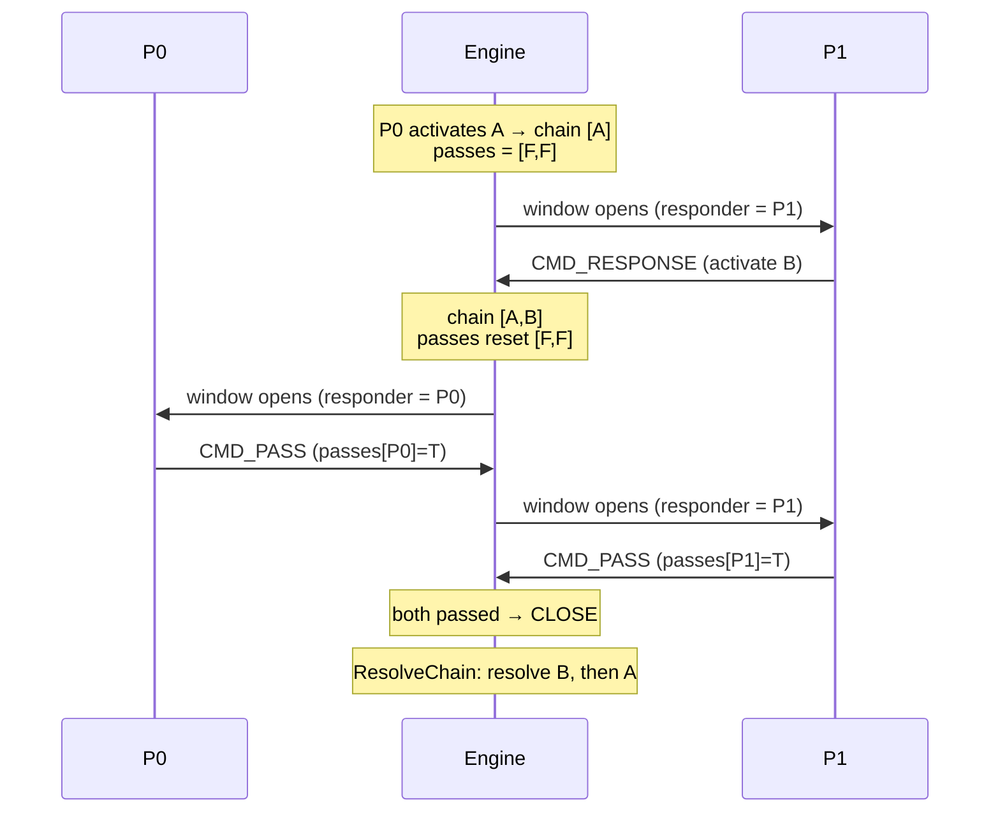

# The Chain Engine

**What this chapter covers:** why effects don't resolve instantly, how activation builds a *chain* of links, how the opponent's response window ping-pongs, how **spell speed** gates who may respond, and how the whole stack unwinds last-in-first-out.

**Mental model:** a stack of dinner plates. Each activated effect is a plate you *add* on top; nothing gets washed until everyone stops adding — then you wash from the **top down**.

---

## Why a chain at all

- Activating an effect does **not** run it. It just puts a link on a stack.
- After each link, the *other* player gets a **response window** — a chance to add their own link on top.
- When both players stop adding, the stack resolves **LIFO** (last-in-first-out): the newest effect resolves first, the first-activated resolves last.

```
instant (naive):  activate A ─────────────────────► resolve A
chained (real):   activate A → [respond?] → ... → resolve top-down
```

**Why?** So the opponent can react *before* your effect happens. You nuke their monster → they chain a "return it to my hand" → their effect resolves first, so there's nothing left for your nuke to hit. That interaction is impossible without the gap between "activated" and "resolved."

---

## The data model

### `Duel.chain: Vec<ChainLink>`

The chain is just a growable list. **Index 0 = bottom = link 1** (first activated). **The back = the top** (most recent).

### A `ChainLink` snapshots one activated effect

`src/chain.rs:4`:

```rust
pub struct ChainLink {
    pub effect_seq: usize,     // which effect to run (index into the registry)
    pub card: CardId,          // the source card (for its post-resolve GY trip)
    pub activator: usize,      // controlling player (drives YOU/OPPONENT)
    pub targets: Vec<CardId>,  // cards chosen at activation
    pub event: EventSnapshot,  // the event that fired it (triggers only); Default for a plain activation
}
```

> **Why snapshot per link?** The effect scratchpad (`effect_ctx`) is a *single shared object* — every link would overwrite it. So each link carries its own copy of activator + targets + event, and resolution restores them right before that link runs. (Chapter 6 covers the `event` field — the snapshot journey.)

**As an ASCII stack** (three links deep, P1's turn):

```
        ┌───────────────────────────┐
top →   │ link 3  C  activator=P1    │  ← resolves FIRST
        ├───────────────────────────┤
        │ link 2  B  activator=P0    │
        ├───────────────────────────┤
bottom  │ link 1  A  activator=P1    │  ← resolves LAST
        └───────────────────────────┘
```

---

## `push_chain_link` — the one funnel for every add

**Every** link — a manual activation, a chained response, a trigger — goes through one helper. Its job: push the link **and** reset the response window's pass-tracking.

`src/duel/scripting.rs:255`:

```rust
fn push_chain_link(&mut self, effect_seq, card, activator, targets, event) {
    self.chain.push(ChainLink { effect_seq, card, activator, targets, event });
    self.passes = [false, false];   // a new link re-opens the window for BOTH players
}
```

- `passes: [bool; 2]` = one "I pass" flag per player.
- **Adding any link resets both flags to `false`.** So a player who passed earlier gets a *fresh* window the moment the opponent chains something new.
- Funneling every add through here means the reset can never be forgotten.

Where the funnel is fed:
- `activate` → plain activation, `EventSnapshot::default()` (no firing event) — `scripting.rs:213` / `:247`.
- `process_events` → each fired trigger, carrying its firing event's snapshot — `scripting.rs:524` (see Chapter 6).

---

## The response window: `ChainResponse` ping-pong

After a link lands, the engine opens a window for the *opponent* of whoever just added. The `ChainResponse` processor drives it, bouncing between players until **two passes in a row**.

`src/duel/driver.rs:428`:

```rust
Processor::ChainResponse { step, player } => match step {
    0 => {                              // open the window for `player`
        self.responder = *player;
        self.messages.push(MSG_SELECT_CHAIN);
        *step += 1;
        false
    }
    _ => {
        let response = self.responses[0];
        match response {
            CMD_PASS => {
                self.passes[*player] = true;
                if self.passes[1 - *player] {
                    true                // BOTH passed → window closes, fall to ResolveChain
                } else {
                    // hand the window to the other player
                    self.processor_stack.push(Processor::ChainResponse { step: 0, player: 1 - *player });
                    true
                }
            }
            CMD_RESPONSE => {
                let effect_index = self.responses[1] as usize;
                let (card, slot) = self.response_options_for(*player)[effect_index];
                let _ = self.activate(card, slot, *player);   // funnels through push_chain_link → resets passes
                self.processor_stack.push(Processor::ChainResponse { step: 0, player: 1 - *player });
                true
            }
            _ => true,
        }
    }
}
```

Key points:

- **The opponent responds first.** `process_events` and the `Activate` arm push `ChainResponse { player: 1 - turn_player }` (or `1 - *player`) — never the adder's own window first (`driver.rs:269`, `:533`).
- **PASS** sets that player's flag. If the *other* flag is already set → close. Otherwise hand off. A player with **no legal response is not skipped by code here** — the window still opens, they just have only "pass" to choose (`response_options_for` returns an empty list → the UI offers pass alone).
- **CMD_RESPONSE** activates the chosen effect. Because `activate` funnels through `push_chain_link`, `passes` resets automatically — no manual reset here.

### Ping-pong sequence (2-link chain)



**Dry-run trace, values:**

```
P0 activates A     chain [A]        window → P1     passes [F,F]
P1 responds B      chain [A,B]      window → P0     passes [F,F]  (reset by the add)
P0 passes          passes [T,F]     window → P1
P1 passes          passes [T,T]     BOTH set → CLOSE
resolve LIFO       B, then A
```

Note the middle: the effect is **committed but not yet resolved**. That gap is the whole reason the chain exists.

---

## Spell speed — the response gate

Not every effect may respond to every link. Each effect has a **spell speed 0–3**; the responder's speed must clear a gate against the top link.

### The rule

- **Speed 1 can only *start* a chain** — never respond.
- To chain onto an existing link, your speed must be **≥ 2 AND ≥ the top link's speed**.

```
top = normal spell (1)   → quick(2) ✓    another SS1 ✗
top = quick-play  (2)    → quick(2) ✓    counter trap(3) ✓    SS1 ✗
top = counter trap(3)    → counter(3) ✓                       quick(2) ✗
```

### Deriving speed: `spell_speed(kind, type, subtype) -> 0..3`

Speed is **not stored** — it's a pure function of the effect's kind plus the card's type + subtype. `src/effect.rs:133`:

```rust
pub fn spell_speed(kind, card_type, spell_type: Option<u32>, trap_type: Option<u32>) -> u8 {
    match kind {
        EffectKind::Quick => 2,                          // quick effect
        EffectKind::Ignition | EffectKind::Trigger => 1, // ignition / trigger
        EffectKind::Activate if card_type & TYPE_TRAP != 0 => {
            if trap_type == Some(TRAP_COUNTER) { 3 } else { 2 }   // counter=3, normal/continuous=2
        }
        EffectKind::Activate if card_type & TYPE_SPELL != 0 => {
            if spell_type == Some(SPELL_QUICKPLAY) { 2 } else { 1 } // quick-play=2, else normal=1
        }
        EffectKind::Activate => 0,                       // monster activation → non-chainable
    }
}
```

**Truth table:**

| kind | card type · subtype | speed |
|---|---|---|
| `Quick` | any | 2 |
| `Ignition` | any | 1 |
| `Trigger` | any | 1 |
| `Activate` | spell · `SPELL_QUICKPLAY` | 2 |
| `Activate` | spell · else (normal/continuous/field/…) | 1 |
| `Activate` | trap · `TRAP_COUNTER` | 3 |
| `Activate` | trap · else (normal/continuous) | 2 |
| `Activate` | monster | 0 |

> Mirrors EDOPro's `effect::get_speed()` (`effect.cpp:694`), which also derives rather than stores. **We diverge on subtype storage:** EDOPro packs subtypes into the `TYPE_` bitmask; we use per-class enums (`spell_type = SPELL_*`, `trap_type = TRAP_*`) as the single source of truth. See `docs/chain.md`.

### `speed_of` — the top link's speed

`src/duel/scripting.rs:316` looks up a link's card + effect kind and feeds them to `spell_speed`:

```rust
pub fn speed_of(&self, link: &ChainLink) -> u8 {
    let Some(data) = self.card_data(link.card) else { return 0 };  // card gone → non-chainable
    let kind = self.effect_kind(&self.effects.borrow()[link.effect_seq].1);
    spell_speed(kind, data.card_type, data.spell_type, data.trap_type)
}
```

### `chainable_effects` / `collect_chainable` — applying the gate

`chainable_effects` (`scripting.rs:329`) gathers the responder's legal responses; `collect_chainable` (`scripting.rs:371`) is where the gate actually bites:

```rust
let speed = spell_speed(kind, data.card_type, data.spell_type, data.trap_type);
if speed >= 2                                   // SS1 can never respond
    && speed >= top_speed                       // and must out-or-match the top link
    && kind == want
    && self.check_condition(effect).unwrap_or(false)
    && self.has_legal_target(effect)
{
    out.push((card, slot));
}
```

- `speed >= 2` self-filters every speed-1 effect (normal spells, ignition) — no separate SS1 pre-check needed.
- `speed >= top_speed` enforces the "match or beat the top link" rule.
- **Scope now:** hand `Activate` effects only (a quick-play spell passes the gate). Field `QUICK` monster effects join a later rung; `IGNITION` (speed 1) can never chain, so there's no monster loop here yet.

---

## `resolve_chain` — the LIFO unwind

Once both players pass, the chain resolves. `resolve_chain` pops the **back** (top) repeatedly, restores each link's context, runs it, and gives a Spell/Trap its GY trip.

`src/duel/scripting.rs:604`:

```rust
pub fn resolve_chain(&mut self) {
    while let Some(link) = self.chain.pop() {          // pop the TOP → LIFO
        {
            let mut ctx = self.effect_ctx.borrow_mut();
            ctx.activator = link.activator;            // restore THIS link's context
            ctx.targets   = link.targets;
            ctx.self_card = Some(link.card);
            ctx.event     = link.event;                // restore the firing event's details
        }
        let _ = self.resolve_effect(link.effect_seq);  // run the `resolve` stage

        let is_spell = self.effects.borrow().get(link.effect_seq)
            .map(|(_, t)| self.effect_kind(t)) == Some(EffectKind::Activate);
        if is_spell {
            self.send_to(link.card, Zone::GY);         // Spell/Trap → GY after resolving
        }
    }
}
```

Per link, in order:
1. **Restore** activator, targets, self_card, event into the shared scratchpad.
2. **Run** the effect's `resolve` stage (`resolve_effect` also applies its destroy/move intents).
3. **Lifecycle** — a resolved Spell/Trap (`EffectKind::Activate`) heads to the GY.

> EDOPro parallel: `Processors::SolveChain` reverse-iterates (`rbegin()`) and pops the back — `processor.cpp:4096`.

### How it rides the processor stack

The stack rule: **top runs first**, and pushed children run before the pusher's next step. So you push in **reverse** of desired order. The `Activate` arm (`driver.rs:263`) sets up:

```
push IdleCommand    ← runs LAST   (back to the Main-Phase menu)
push ResolveChain   ← runs 2nd    (drains the chain once windows close)
push ChainResponse  ← runs FIRST  (the response window ping-pong)
```

`ResolveChain` is a one-shot: it calls `resolve_chain` and finishes (`driver.rs:424`). It sits *below* the response windows, so it only fires after both players have passed.

---

## The timing-window variant (brief)

A quick effect can start a chain even when the chain is **empty** — at a battle timing window like damage calculation (e.g. Kuriboh at pre-damage). `response_options_for` handles both cases from one entry point.

`src/duel/scripting.rs:563`:

```rust
pub fn response_options_for(&self, player: usize) -> Vec<(CardId, usize)> {
    match self.chain.last() {
        Some(top) => self.chainable_effects(player, top),          // a chain exists → spell-speed gate
        None => match self.window_timing {
            Some(timing) => self.timed_hand_quick_effects(player, timing),  // no chain, a timing window is open
            None => Vec::new(),                                    // neither → nothing to do
        },
    }
}
```

- **Chain exists** → gate responses by spell speed against the top link.
- **No chain, timing window open** → offer QUICK hand effects whose `event` matches that timing (no top link to gate against — QUICK is speed 2, enough to open).

The battle-side details (how those windows open and close around damage) live in the battle chapter. Here the point is only: **one gatherer, two situations.**

---

## In one breath

- **Chain = a stack of activated-but-unresolved effects.** Add on top, wash from the top down (LIFO).
- **`push_chain_link`** is the single funnel for every add; it resets the two-flag response window.
- **`ChainResponse`** ping-pongs opponent-first until **two passes in a row**, then `ResolveChain` unwinds.
- **Spell speed** (derived, 0–3) gates responses: `>= 2` and `>= top link`.
- **`resolve_chain`** pops the back, restores that link's context, resolves it, and sends a Spell/Trap to the GY.
