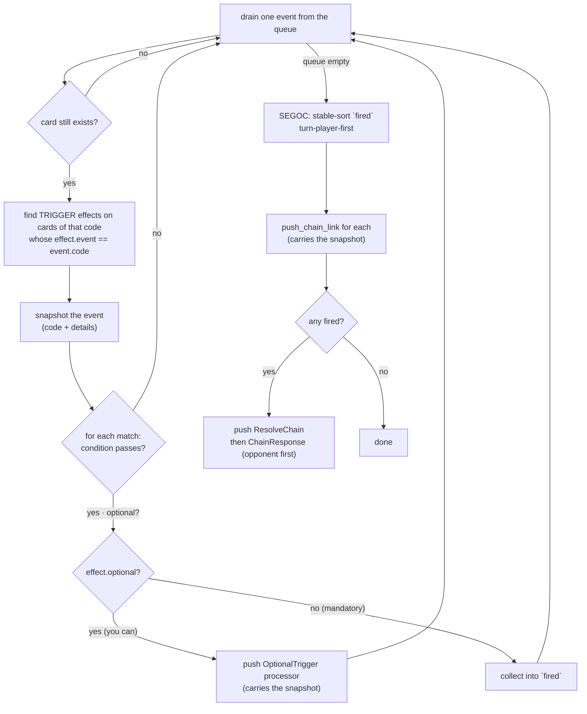

# Events & Triggers

**What this chapter covers:** how a game action (like a destroy) raises an *event*, how `process_events` finds the triggers that fire, how they get routed onto the chain (mandatory) or a yes/no (optional), how simultaneous triggers are ordered (**SEGOC**), and the **snapshot journey** that lets a trigger read event details long after the event is gone.

**Mental model:** the game leaves *sticky notes* ("Beaver was destroyed by battle") in an outbox. Later, the engine reads each note, checks who cares, and schedules their reactions. The note gets **stapled to the reaction** so its details survive until the reaction actually runs.

---

## The event queue

A game action pushes a `DuelEvent` onto `Duel.events` (a `VecDeque`). `src/event.rs:17`:

```rust
pub struct DuelEvent {
    pub code: u32,                                 // e.g. EVENT_DESTROYED
    pub card: CardId,                              // the card the event is "about"
    pub reason: Reason,                            // REASON_DESTROY | REASON_BATTLE | ...
    pub details: BTreeMap<String, EventDetail>,    // the sticky-note payload
}
```

- **`details` is a keyed bag** (`BTreeMap`, so iteration is deterministic). Values are one of four kinds — `src/event.rs:27`:

```rust
pub enum EventDetail { Card(CardId), Cards(Vec<CardId>), Int(i32), Bool(bool) }
```

### Example: `destroy` raises `EVENT_DESTROYED`

`destroy` is the single chokepoint for destruction. It stamps the reason on the card, sends it to the GY, then queues the event with a filled detail bag — `src/duel/board.rs:198`:

```rust
self.events.push_back(DuelEvent {
    code: EVENT_DESTROYED,
    card,
    reason: REASON_DESTROY | reason,
    details: BTreeMap::from([
        ("destroyed_card".to_string(), EventDetail::Card(card)),
        ("by_battle".to_string(),      EventDetail::Bool(by_battle)),
    ]),
});
if by_battle {
    self.events.push_back(DuelEvent { code: EVENT_BATTLE_DESTROYED, /* ... */ });
}
```

So an `EVENT_DESTROYED` note always carries `"destroyed_card"` (which card) and `"by_battle"` (how it died). A battle kill queues a second `EVENT_BATTLE_DESTROYED` note too.

---

## `process_events` — drain, match, route

`process_events` runs after **every** processor step (`driver.rs:83`). It drains the whole queue; for each event it finds the TRIGGER effects that should fire, then routes them by mandatory vs optional.

### Routing flowchart



### The matching + routing code

`src/duel/scripting.rs:469`:

```rust
while let Some(event) = self.events.pop_front() {
    let Some(card) = self.get_card(event.card) else { continue };   // card gone → skip
    let card_code = card.code;
    let player = self.controller_of(event.card);

    // TRIGGER effects on this card whose `event` field matches the event code.
    let indexes: Vec<usize> = self.effects.borrow().iter().enumerate()
        .filter(|(_, (code, t))| {
            *code == card_code
                && self.effect_kind(t) == EffectKind::Trigger
                && t.get::<u32>("event").unwrap_or(0) == event.code
        })
        .map(|(i, _)| i).collect();

    // Freeze the details NOW — the trigger resolves much later (see the snapshot journey).
    let snapshot = EventSnapshot { code: event.code, details: event.details };

    for idx in indexes {
        self.effect_ctx.borrow_mut().activator = player;
        let t = self.effects.borrow()[idx].1.clone();
        if !self.check_condition(&t).unwrap_or(false) { continue; }   // condition gates the trigger
        if t.get::<bool>("optional").unwrap_or(false) {
            self.processor_stack.push(Processor::OptionalTrigger {     // "you can" → yes/no
                step: 0, effect: idx, card: event.card, player, event: snapshot.clone(),
            });
        } else {
            fired.push((idx, event.card, player, snapshot.clone()));   // mandatory → onto the chain
        }
    }
}
```

- **A match needs three things:** same card code, kind `Trigger`, and the effect's `event` field equals the event's `code`.
- **`condition` gates it** — a "when destroyed by battle" trigger checks `by_battle` here and bows out if false.
- **Mandatory** → collected into `fired` (goes on the chain).
- **Optional** ("you can") → an `OptionalTrigger` processor, which asks yes/no.

### Optional triggers: the `OptionalTrigger` processor

`src/duel/driver.rs:399`:

```rust
Processor::OptionalTrigger { step, effect, card, player, event } => match step {
    0 => { *step += 1; self.messages.push(MSG_SELECT_YESNO); false }   // ask
    _ => {
        if self.responses.first().copied() == Some(1) {                // said yes
            let mut ctx = self.effect_ctx.borrow_mut();
            ctx.activator = *player;
            ctx.self_card = Some(*card);
            ctx.event     = event.clone();                             // restore the frozen details
            drop(ctx);
            let _ = self.resolve_effect(*effect);
        }
        true
    }
}
```

Optionals currently resolve **inline** (not through the chain) — say yes and the effect runs immediately. SEGOC-ordering them alongside mandatory triggers is deferred.

---

## SEGOC — Simultaneous Effects Go On Chain

**The problem:** a board-wipe destroys three monsters at once, each with a "when destroyed" trigger. They can't all be "first." SEGOC puts them on **one chain in a defined order**.

**The rule (mandatory buckets):** turn player's triggers first, then the opponent's. `src/duel/scripting.rs:521`:

```rust
// turn player's triggers first. STABLE sort keeps each player's triggers in event order.
fired.sort_by_key(|(_, _, player, _)| *player != turn_player);
```

- `false` (turn player) sorts before `true` (opponent).
- **Stable** sort preserves event order *within* one player's triggers — our stand-in for "the player chooses their own order."
- Then each fired trigger becomes a link via `push_chain_link` (carrying its snapshot), and if any fired, the chain machinery is scheduled — `ResolveChain` below a `ChainResponse` that opens for `1 - turn_player` (opponent responds first), `scripting.rs:530`.

**Remember LIFO:** placement order reverses on resolution. Turn-player-mandatory is placed *first* (link 1) → resolves **last**. See `docs/segoc.md` for the full four-bucket table and EDOPro citations. (Only the two mandatory buckets are implemented; optionals are deferred.)

---

## The snapshot journey (this is the key idea)

**The problem:** the event is drained inside `process_events`, but the trigger it fires might resolve **much later** — several links deep on the chain, after a whole response window. By then the `DuelEvent` is long gone from the queue. So how does the trigger still read `"destroyed_card"`?

**The answer:** freeze the event into an `EventSnapshot` and staple it to whatever will resolve later.

`src/event.rs:37`:

```rust
pub struct EventSnapshot {
    pub code: u32,
    pub details: BTreeMap<String, EventDetail>,
}
// Default (code 0) means "no event" — e.g. a plain Spell/Trap activation.
```

Where the snapshot rides:
- **Mandatory trigger** → on the `ChainLink.event` field (`chain.rs:11`).
- **Optional trigger** → on the `OptionalTrigger` processor's `event` field (`driver.rs:404`).

At resolution it's **restored into `ctx.event`** — `resolve_chain` does it at `scripting.rs:611`, `OptionalTrigger` at `driver.rs:417`. Now `e:get_event_detail` can read it.

### The journey, end to end

```mermaid
sequenceDiagram
    participant Game as destroy()
    participant Queue as Duel.events
    participant PE as process_events
    participant Link as ChainLink.event
    participant RC as resolve_chain
    participant Lua as e:get_event_detail

    Game->>Queue: push DuelEvent{ EVENT_DESTROYED,<br/>details["destroyed_card"]=c }
    PE->>Queue: drain the event
    PE->>PE: match TRIGGER effects (event field == code)
    PE->>Link: snapshot (code+details) onto the link
    Note over Link: the event is now GONE from the queue,<br/>but frozen on the link
    RC->>Link: pop link, restore snapshot → ctx.event
    RC->>Lua: run the `resolve` stage
    Lua->>Lua: get_event_detail(EVENT_DESTROYED, "destroyed_card") → c
```

**Dry-run values:**

```
destroy(c)          events = [ EVENT_DESTROYED{ destroyed_card=c } ]
process_events      drain it → trigger on c matches
                    snapshot = { code=EVENT_DESTROYED, details={destroyed_card: c} }
                    link.event = snapshot        events = []   (note is gone from queue)
resolve_chain       pop link → ctx.event = snapshot
                    run resolve → get_event_detail(...) reads ctx.event → returns c
```

---

## `e:get_event_detail(code, key)` — the code is a guard

The verb reads a detail from the **current** `ctx.event`, but **only if that event's code matches** — otherwise nil. `src/effect.rs:262`:

```rust
let get_event_detail = lua.create_function(move |lua, (code, key): (u32, String)| {
    let ctx = c.borrow();
    if ctx.event.code != code {                    // the CODE is a guard
        return Ok(mlua::Value::Nil);
    }
    Ok(match ctx.event.details.get(&key) {
        Some(EventDetail::Card(id))   => mlua::Value::Integer(encode(*id)),
        Some(EventDetail::Cards(ids)) => mlua::Value::Table(lua.create_sequence_from(encode_ids(ids))?),
        Some(EventDetail::Int(n))     => mlua::Value::Integer(*n as i64),
        Some(EventDetail::Bool(b))    => mlua::Value::Boolean(*b),
        None => mlua::Value::Nil,
    })
})?;
```

Why guard by code? So a card can safely ask "if the current event is an `EVENT_DESTROYED`, give me its destroyed card" without accidentally reading a *different* event's bag. Wrong event → nil, and the script handles nil.

### End to end: the `EventReader` fixture

`tests/fixtures/EventReader.lua` — a monster that, **when destroyed**, banishes the exact card the event reports as destroyed:

```lua
local e = EventReader:add_effect(TRIGGER)
e.event = EVENT_DESTROYED                      -- fire on EVENT_DESTROYED

function e:resolve(ef)
    -- code guards the query: returns the card only if the current event IS an EVENT_DESTROYED
    local destroyed = ef:get_event_detail(EVENT_DESTROYED, "destroyed_card")
    ef:send({ destroyed }, ZONE_BANISHMENT)    -- banish exactly that card
end
```

The test (`tests/test_event_detail.rs:23`) proves the whole pipeline:

```rust
duel.place(PLAYER_0, c, Zone::MonsterZone);
duel.destroy(c, REASON_EFFECT);   // EVENT_DESTROYED{ destroyed_card = c } queued
duel.process_events();            // trigger matched; snapshot stapled to the link
duel.resolve_chain();             // snapshot restored → resolve reads it → banish c

assert_eq!(duel.zone_of(c), Some(Zone::Banishment));  // the trigger read the event and banished it
```

Crucially the fixture reads the destroyed card **from the event**, not from `self_card` — proving the detail bag survived the trip from queue → snapshot → link → resolution. An optional variant (`EventReaderOptional.lua`, same file's second test) does the same after a yes/no, proving the snapshot rides the `OptionalTrigger` processor too.

---

## In one breath

- A game action pushes a **`DuelEvent`** (code + card + reason + a keyed **detail bag**) onto `Duel.events`.
- **`process_events`** drains the queue, finds matching **TRIGGER** effects (same code, kind, `event` field) whose condition passes, and routes them: **mandatory → the chain**, **optional → a yes/no**.
- **SEGOC** stable-sorts simultaneous mandatory triggers **turn-player-first** before placing them.
- The event is frozen into an **`EventSnapshot`** and carried on the link (or the optional processor) so it's still readable when the trigger resolves **later**.
- **`e:get_event_detail(code, key)`** reads that snapshot, with the code as a guard — the `EventReader` fixture banishes exactly the card the event reported.
