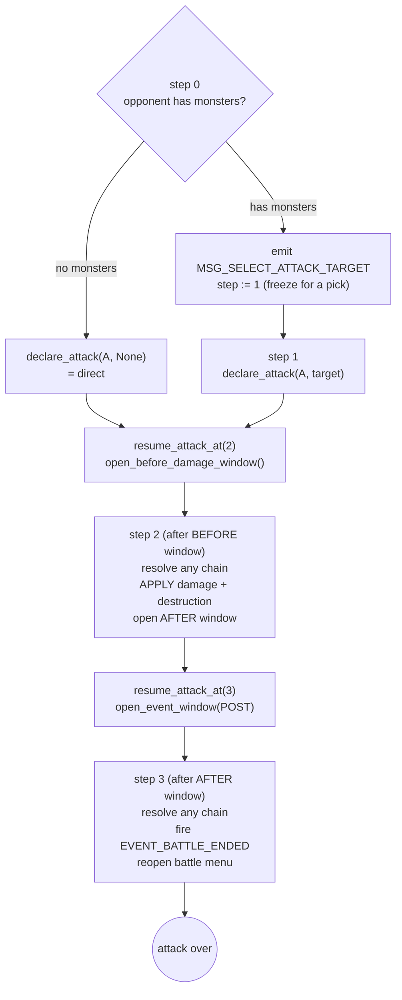

# The Battle System

**What this chapter covers:** how the Battle Phase declares an attack, how the `Attack` task steps through open-a-window → resolve → damage → destroy, and the "push-and-return-true" idiom that lets a battle pause for a quick effect without freezing.

**Mental model:** an attack is a *4-step wizard*. Between steps it can pop open a response window (a sub-task) and come back exactly where it left off.

---

## The menu: what you can attack with

Two lists drive the Battle Phase (`src/duel/battle.rs:31`, `:41`):

- **`attackers(player)`** — the monsters you may attack *with*:
  - in your Monster Zone,
  - **face-up in attack position** (`p.is_attack() && p.is_face_up()`),
  - **haven't attacked this turn** (not in `attacked_this_turn`).
- **`attack_targets(player)`** — what you may attack *into*: every monster the opponent controls. **Empty → the attack can only be direct.**

The menu itself is `Processor::BattleCommand` (`src/duel/driver.rs:295`):

| Response | Meaning |
|----------|---------|
| `CMD_NEXT_PHASE` | end the Battle Phase (menu done) |
| `CMD_ATTACK, idx` | attack with `attackers()[idx]` → push an `Attack` task |
| anything else | re-show the menu |

After an attack fully resolves, `reopen_battle_menu` (`src/duel/driver.rs:473`) pushes a fresh `BattleCommand` so you can swing with another monster.

---

## Declaring an attack

`declare_attack(attacker, target)` records the swing (`src/duel/battle.rs:48`):

- `target = Some(id)` → attacker vs that monster.
- `target = None` → **direct attack** (opponent controls nothing).
- It also marks the attacker in `attacked_this_turn` — that's the one-attack-per-turn rule.

```
declare_attack(A, Some(B))  → last_attack = (A, Some(B)); attacked_this_turn += A
declare_attack(A, None)     → last_attack = (A, None);     attacked_this_turn += A   [direct]
```

---

## The `Attack` task is a stepped state machine

One attack is **not** one function call. It's a `Processor::Attack { step, attacker, player }` that runs a few steps, yielding the CPU between them so a response window can slot in.



Step by step (`src/duel/driver.rs:332`):

- **step 0** — if `attack_targets` is empty → declare direct, arm the resume, open the before-damage window, `true`. Otherwise emit `MSG_SELECT_ATTACK_TARGET`, set `step = 1`, `false` (freeze for the human).
- **step 1** — read the picked index → `declare_attack(attacker, target)` → arm resume at step 2 → open the before-damage window → `true`.
- **step 2** — the before-window has closed. Resolve anything chained there, **apply damage + destruction**, then open the after-damage window (arming resume at step 3) → `true`.
- **step 3** — the after-window has closed. Resolve anything chained there, fire `EVENT_BATTLE_ENDED`, reopen the menu → `true`.

---

## The push-and-return-true idiom

**The answer:** to run a sub-window *and then continue*, a step pushes a fresh continuation of itself, pushes the window on top, and returns **`true`** (finished) — it does **not** return `false` (paused).

Why not just pause? Look at the driver's pause branch (`src/duel/driver.rs:88`):

```rust
// run_unit returned false (paused):
let is_freeze = unit.needs_answer();
self.processor_stack.insert(depth_before, unit); // put it BACK, below its children
match is_freeze {
    true  => DuelStatus::Awaiting,  // needs a human → FREEZE the whole duel
    false => DuelStatus::Continue,
}
```

- `Processor::Attack` has `needs_answer() == true` (`src/processor.rs:100`).
- So if step 0/1/2 returned `false`, the duel would **freeze right there** — before the pushed window ever runs. Wrong: the parent isn't the thing asking a human; the window is.

The fix (`resume_attack_at`, `src/duel/driver.rs:481`):

```rust
fn resume_attack_at(&mut self, step: u16, attacker: CardId, player: usize) {
    self.processor_stack.push(Processor::Attack { step, attacker, player });
}
```

Order matters — continuation first, window second, so the **window lands on top**:

```rust
// step 1, src/duel/driver.rs:357
self.declare_attack(*attacker, target);
self.resume_attack_at(2, *attacker, *player);   // push Attack{step:2}
self.open_before_damage_window(*attacker, target); // push ChainResponse ON TOP
true                                              // finish THIS unit (step 1)
```

Dry-run of the stack (top = last):

```
before:  [ ..., Attack{step:1} ]                         (running now)
push cont:   [ ..., Attack{step:2} ]
push window: [ ..., Attack{step:2}, ChainResponse ]
return true → drop the finished Attack{step:1}
driver pops: ChainResponse runs FIRST → then Attack{step:2} resumes
```

The window runs, closes, and control falls through to the continuation — no freeze, state intact.

---

## The damage split: preview → apply → destroy

Battle math is separated into three functions, mirroring EDOPro's `calc → apply → destroy` order.

### 1. `battle_damage_preview` — compute, apply nothing

`src/duel/battle.rs:63`. Returns `[player0_damage, player1_damage]` using the **current** ATK/DEF (so modifiers are already folded in — see Chapter 8):

| Situation | Result |
|-----------|--------|
| direct (`target = None`) | defender takes `attacker_atk` |
| ATK vs **attack**-pos monster, `atk > def_atk` | target's controller takes the difference |
| ATK vs attack-pos monster, `atk < def_atk` | **attacker's** controller takes the difference |
| ATK vs attack-pos monster, equal | no damage (both die — see destroy) |
| ATK vs **defense**-pos monster, `atk < def` | attacker's controller takes `def − atk` |
| ATK vs defense-pos monster, `atk >= def` | no damage |

Dry-run: `A(1500 ATK) → direct` → `preview = [0, 1500]` (P1 takes 1500).

### 2. `apply_battle_damage` — deal the numbers

`src/duel/battle.rs:165`. Just `deal_damage(P0, dmg[0]); deal_damage(P1, dmg[1])`.

### 3. `apply_battle_destruction` — kill the loser(s)

`src/duel/battle.rs:174`. Direct attack destroys nothing. Otherwise higher ATK wins (loser → GY, tie kills both); vs defense, `atk > def` destroys the wall. Uses `destroy(.., REASON_BATTLE)` so the reason is recorded for triggers.

### `resolve_battle` — the all-in-one

`src/duel/battle.rs:157`. Preview → apply → destroy in one call. Used by **direct callers and tests** when there's no damage-calc window to interpose:

```rust
pub fn resolve_battle(&mut self, attacker, target) {
    let dmg = self.battle_damage_preview(attacker, target);
    self.apply_battle_damage(dmg);
    self.apply_battle_destruction(attacker, target);
}
```

The **processor path splits them** (step 2) so continuous effects can adjust the numbers *between* preview and apply. That's how Kuriboh zeroes damage:

```rust
// step 2, src/duel/driver.rs:373
let mut dmg = self.effect_ctx.borrow().pending_damage;   // the preview from before-window
for (p, d) in dmg.iter_mut().enumerate() {
    if !self.can_take_battle_damage(p) {  // NoBattleDamage gate (Chapter 8)
        *d = 0;
    }
}
self.apply_battle_damage(dmg);
self.apply_battle_destruction(a, target);
```

---

## Before/after windows: `open_event_window`

Both damage windows are `open_event_window(timing)` (`src/duel/battle.rs:118`). It opens a `ChainResponse` for **quick effects keyed to that timing** — the hook that offers Kuriboh at damage calculation.

Behavior:

- Sets `window_timing = Some(timing)` so `response_options_for` knows which timing to match.
- Order is **turn player first**, then opponent (`[turn_player, 1 - turn_player]`).
- A player with **no matching quick effect is auto-passed** — a window only opens for someone who can actually act.
- If nobody can respond → clears `window_timing`, returns `false`, caller proceeds straight to applying the battle.

```rust
// src/duel/battle.rs:128
let Some(first) = order.into_iter().find(|&p| has_opts[p]) else {
    self.window_timing = None; // nobody can respond → no window
    return false;
};
self.passes = [!has_opts[0], !has_opts[1]]; // no-option players start "already passed"
self.processor_stack.push(Processor::ChainResponse { step: 0, player: first });
true
```

The **before** window is opened via `open_before_damage_window` (`src/duel/battle.rs:102`), which first fills `pending_damage` from the preview so a responder can read `e:battle_damage()`:

```rust
self.effect_ctx.borrow_mut().pending_damage = self.battle_damage_preview(attacker, target);
self.open_event_window(EVENT_PRE_DAMAGE_CALCULATION)
```

Timings used:

| Window | Timing event | Opened at |
|--------|--------------|-----------|
| before damage | `EVENT_PRE_DAMAGE_CALCULATION` (5) | step 0 / step 1 |
| after damage | `EVENT_POST_DAMAGE_CALCULATION` (6) | step 2 |

This is exactly where **Kuriboh** is offered — a quick effect from the hand keyed to `EVENT_PRE_DAMAGE_CALCULATION`, which grants a `NoBattleDamage` player modifier read back at step 2. See **Chapter 10** for that card end-to-end, and Chapter 9 for how the "that battle only" removal is queued.

---

## `EVENT_BATTLE_ENDED`

Fired once, at the **very end** of the attack flow (step 3, `src/duel/driver.rs:394`):

```rust
self.fire_subscriptions(EVENT_BATTLE_ENDED);
self.reopen_battle_menu(*player);
```

It runs any subscriptions queued for "when this battle ends" — e.g. Kuriboh removing its own temporary modifier. Subscriptions and `queue` are Chapter 9.

---

## In one breath

- **Attackers** = your face-up attack-position monsters that haven't swung. **`None` target = direct.**
- The **`Attack` task steps**: pick/declare → before-window → apply damage+destroy → after-window → `EVENT_BATTLE_ENDED`.
- **Push-and-return-true**: push a continuation + push the window on top + return `true` — because returning `false` on an `Attack` (which `needs_answer`) would freeze the duel before the window runs.
- Damage is **preview → apply → destroy**, split so continuous effects (Kuriboh's `NoBattleDamage`) can adjust the numbers in between.
