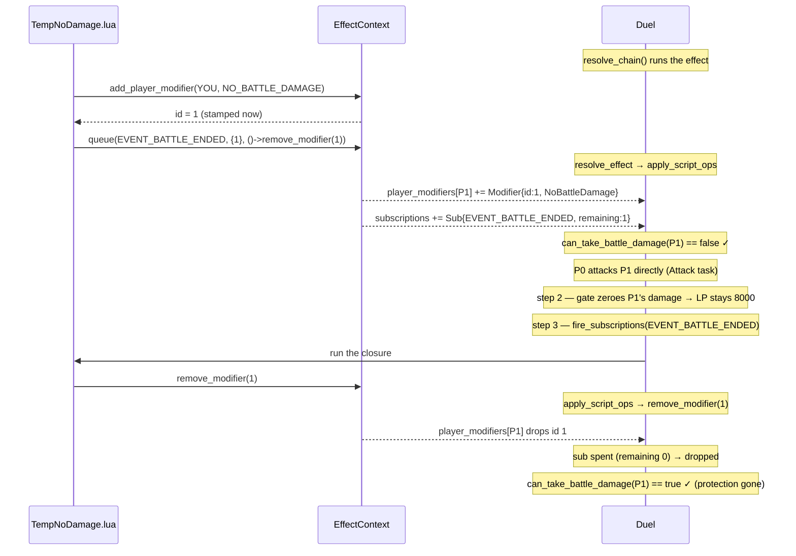

# Subscriptions & the Queue

**What this chapter covers:** how a card says "run this later, when X happens" (`e:queue`), how the engine stores and fires those closures, and the describe-then-execute rule that keeps Lua from touching the `Duel` directly.

**Mental model:** `queue` is a **standing order at a counter**: "when the battle-ended bell rings, do this — up to N times." `fire_subscriptions` rings the bell.

---

## `e:queue` — register a reaction

`e:queue(event, {count, period}, fn)` (`src/effect.rs:309`): run `fn` when `event` fires, up to `count` times.

```lua
-- run once, when a battle ends
ef:queue(EVENT_BATTLE_ENDED, { 1, ONCE }, function() ef:remove_modifier(passive) end)
```

Stored as a `Subscription` on the `Duel` (`src/effect.rs:73`):

```rust
pub struct Subscription {
    pub event: u32,          // which bell
    pub remaining: u32,      // firings left (the `count`)
    pub func: mlua::Function,// the closure to run
}
```

- The frequency table is `{ count, period }`; **only `count` is modeled** — `period` (`ONCE`/`PER_TURN`/…, `src/duel/prelude/modifiers.lua:11`) is reserved.
- The verb just records into `ctx.subscriptions_to_add` (see describe-then-execute below); the closure lands on the `Duel` afterward.

---

## `fire_subscriptions` — ring the bell

`src/duel/scripting.rs:126`: run every subscription waiting on `event`, once each, decrement, keep the survivors.

```rust
pub fn fire_subscriptions(&mut self, event: u32) {
    let subs = std::mem::take(&mut self.subscriptions);
    let (fired, mut keep): (Vec<Subscription>, Vec<Subscription>) =
        subs.into_iter().partition(|s| s.event == event);
    for mut sub in fired {
        let _ = sub.func.call::<()>(());   // run the closure
        self.apply_script_ops();           // drain what it recorded (see below)
        sub.remaining = sub.remaining.saturating_sub(1);
        if sub.remaining > 0 {
            keep.push(sub);                // still has firings → keep it
        }
    }
    keep.append(&mut self.subscriptions);  // anything queued DURING firing survives too
    self.subscriptions = keep;
}
```

- `partition` splits matching subs from the rest.
- Each fired sub runs, then **its recorded ops are applied immediately** via `apply_script_ops`.
- A sub with firings left is kept; a spent one is dropped.
- `EVENT_BATTLE_ENDED` is the bell rung at the end of the `Attack` flow (`src/duel/driver.rs:394`).

---

## Describe-then-execute (why Lua never touches the `Duel`)

**The answer:** a Lua verb can't hold a `&mut Duel` — that would be a borrow cycle (the VM is *owned by* the `Duel`). So verbs **record intent into `ctx`**, and the `Duel` **drains those records afterward**.

The intent fields on `EffectContext` (`src/effect.rs:29`):

| Field | Filled by verb | Drained by |
|-------|----------------|-----------|
| `player_mods_to_add` | `e:add_player_modifier` | `apply_script_ops` |
| `mods_to_remove` | `e:remove_modifier` | `apply_script_ops` |
| `subscriptions_to_add` | `e:queue` | `apply_script_ops` |
| `next_modifier_id` | (shared counter) | stamped now, applied later |

`apply_script_ops` (`src/duel/scripting.rs:90`) drains all three onto the real `Duel`:

```rust
fn apply_script_ops(&mut self) {
    // 1. grant recorded player modifiers
    for (id, player, source, mod_type) in adds {
        self.player_modifiers[player].push(Modifier { id, source, mod_type });
    }
    // 2. remove recorded ids
    for id in removes { self.remove_modifier(id); }
    // 3. enrol recorded subscriptions
    self.subscriptions.extend(subs);
}
```

It runs **after `resolve`** (`resolve_effect`, `src/duel/scripting.rs:83`) **and after each fired sub** (inside `fire_subscriptions`).

### The `next_modifier_id` trick

`e:add_player_modifier` must **return the new id to Lua synchronously** — so a closure can capture it *now* — even though the modifier isn't added until `apply_script_ops` runs *later*.

Solution: the id counter lives in `ctx`, shared between the verb and the engine (`src/effect.rs:283`):

```rust
ctx.next_modifier_id += 1;
let id = ctx.next_modifier_id;                       // stamp NOW
ctx.player_mods_to_add.push((id, player, source, mod_type)); // apply LATER
Ok(id)                                               // hand it back to Lua immediately
```

So Lua gets a real id it can hold in a closure, and the matching add lands with that same id when `apply_script_ops` drains the record. `add_player_modifier`/`add_modifier` on the `Duel` (`src/duel/board.rs`) draw from the **same counter** via `next_modifier_id()` — one sequence, no collisions.

---

## The "that battle only" pattern

**The answer:** grant a temporary modifier, then `queue` its removal on `EVENT_BATTLE_ENDED`. The battle ends → the bell rings → the closure removes exactly that modifier by id.

`tests/fixtures/TempNoDamage.lua` is the shape (Kuriboh minus the quick-from-hand activation):

```lua
function e:resolve(ef)
    local passive = ef:add_player_modifier(YOU, MOD_NO_BATTLE_DAMAGE) -- grab the id
    ef:queue(EVENT_BATTLE_ENDED, { 1, ONCE },
        function() ef:remove_modifier(passive) end)                   -- remove it later
end
```

### End-to-end trace



This is verified by `test_modifier_expiry.rs`:

- right after resolve → `can_take_battle_damage(P1) == false` (protected),
- direct 1500 attack → P1 still at **8000** (gate zeroed it, Chapter 7 step 2),
- after the battle → `can_take_battle_damage(P1) == true` (the queued removal fired).

The full Kuriboh card — a **quick** effect activated from the hand at the before-damage window — is walked end-to-end in **Chapter 10**; the window that offers it is Chapter 7.

---

## In one breath

- **`e:queue(event, {count}, fn)`** = a standing order stored as a `Subscription`; only `count` is modeled, `period` is reserved.
- **`fire_subscriptions(event)`** runs matching closures once each, decrements, keeps survivors — `EVENT_BATTLE_ENDED` fires at the end of the attack flow.
- **Describe-then-execute**: verbs record into `ctx` (`player_mods_to_add`, `mods_to_remove`, `subscriptions_to_add`); `apply_script_ops` drains them onto the `Duel` — after resolve and after each fired sub.
- The shared **`next_modifier_id`** lets a verb hand Lua a real id *now* while the add is applied *later* — that's what powers the "that battle only" pattern.
