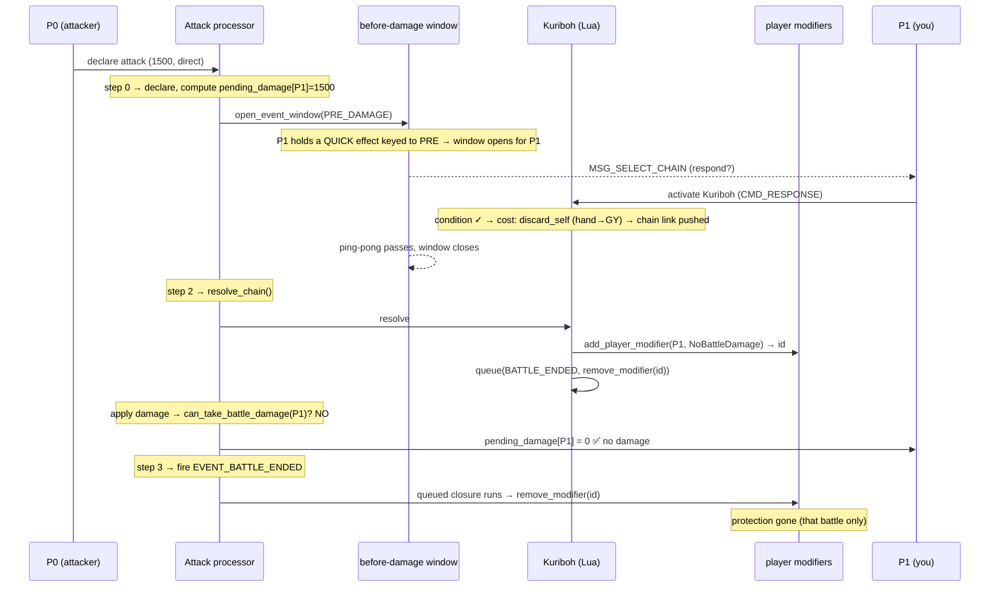

# 10 · Worked Example: Kuriboh

**What this covers:** one card, followed from your hand to the graveyard, touching
*every* subsystem in the engine. If the earlier chapters were the parts, this is the
whole machine turning over once.

**Mental model:** Kuriboh = "the opponent attacks → I discard this from hand → I take
no battle damage from that battle." To make that true, the engine has to open a
window at the right instant, run a quick effect from your hand, pay a discard cost,
resolve it on a chain, grant a *player* condition, honor that condition when damage
lands, and then take it back away when the battle ends. That's the tour.

---

## The card

Kuriboh is a **quick** monster effect, keyed to the moment **before damage is
calculated**:

```lua
local nullify_bd = Kuriboh:add_effect(QUICK, { EFF_CAT_NULLIFY_DAMAGE })
nullify_bd.event = EVENT_PRE_DAMAGE_CALCULATION           -- WHEN it may activate

function nullify_bd:condition(e)                          -- CAN it?
    return e:in_hand(YOU)                --  it's in my hand            (ch 4, ch 6-ish verbs)
        and e:current_player() == OPPONENT  --  it's the opponent's turn (they attacked)
        and e:battle_damage() > 0        --  I'm about to take damage
end

function nullify_bd:cost(e)                               -- WHAT I pay
    e:discard_self()                     --  send this card hand → GY   (ch 3, ch 4)
end

function nullify_bd:resolve(e)                            -- WHAT it does
    local passive = e:add_player_modifier(YOU, MOD_NO_BATTLE_DAMAGE)   -- ch 8
    e:queue(EVENT_BATTLE_ENDED, { 1, ONCE },                           -- ch 9
        function() e:remove_modifier(passive) end)
end
```

> The real card lives (untracked) in `cards/Kuriboh.lua`; its tracked twin
> `tests/fixtures/HandNegate.lua` is identical in shape and is what
> `tests/test_quick_from_hand.rs` drives end-to-end and green.

Four Lua stages, four subsystems. Now watch them fire in order.

---

## The whole flow, one diagram

Opponent (P0, the turn player) attacks you (P1) directly with a 1500-ATK monster.
You hold Kuriboh.



---

## Step by step (with the stack)

**1 · The attack opens a window.** (Chapter 7.)
The `Attack` processor declares the attack, computes what you'd take
(`pending_damage[P1] = 1500`), and calls `open_event_window(EVENT_PRE_DAMAGE_CALCULATION)`.
That helper asks: *does anyone hold a quick effect keyed to this timing?* You do —
Kuriboh. So a `ChainResponse` window opens **for you** (the defender), and the
`Attack` processor parks a continuation on the stack:

```
stack (top → bottom):  [ ChainResponse{P1} , Attack{step:2} ]
```
(Push-in-reverse: the window runs first, the continuation second.)

**2 · The window offers Kuriboh.** (Chapters 5 + 6.)
`response_options_for(P1)` sees the chain is empty but a timing window is open, so it
gathers *timed quick effects from your hand* whose `.event` matches — and runs each
one's `condition`. Kuriboh's condition:

- `in_hand(YOU)` → true (it's in your hand)
- `current_player() == OPPONENT` → true (it's P0's turn — they attacked)
- `battle_damage() > 0` → true (`pending_damage[P1]` is 1500)

All true → Kuriboh is offered.

**3 · You activate it → cost paid → link pushed.** (Chapters 3, 4, 5.)
`activate()` runs the stages describe-then-execute style:
- `cost`: `discard_self()` records a `Discard(self_card)` intent → the engine sends
  Kuriboh **hand → GY** (a plain `send`, *not* a destruction — no event).
- a `ChainLink` is pushed onto `Duel.chain`.

```
Hand:[Kuriboh] --discard cost--> Hand:[] , GY:[Kuriboh]
chain: [ Kuriboh ]
```

**4 · Windows close, the chain resolves.** (Chapter 5.)
Both players pass, the `ChainResponse` ping-pong ends, and the `Attack` continuation
(`step 2`) runs `resolve_chain()`. That pops the Kuriboh link and runs its `resolve`.

**5 · Resolve grants a *player* condition + schedules its removal.** (Chapters 8, 9.)
```lua
local passive = e:add_player_modifier(YOU, MOD_NO_BATTLE_DAMAGE)   -- returns an id
e:queue(EVENT_BATTLE_ENDED, {1, ONCE}, function() e:remove_modifier(passive) end)
```
- `add_player_modifier` stamps a **unique id** (from the shared `ctx` counter) and
  hands it back to Lua *now*, while the actual add is applied right after the stage
  (describe-then-execute). `NoBattleDamage` goes onto **P1's** player-modifier list.
  It's player-scoped, not card-scoped, because Kuriboh works on **direct** attacks —
  there's no defending monster to hang it on.
- `queue` stores a closure as a `Subscription { event: EVENT_BATTLE_ENDED, remaining: 1 }`
  that will later remove *that specific* modifier by its id.

**6 · Damage is applied — and gated.** (Chapters 7, 8.)
Back in the `Attack` step, before spending `pending_damage`:
```rust
for (p, d) in dmg.iter_mut().enumerate() {
    if !self.can_take_battle_damage(p) { *d = 0; }   // driver.rs, Attack step 2
}
```
`can_take_battle_damage(P1)` is `false` (a `NoBattleDamage` modifier is in force), so
`dmg[P1]` becomes **0**. You take no damage. ✅

**7 · The battle ends — protection expires.** (Chapter 9.)
`Attack` step 3 calls `fire_subscriptions(EVENT_BATTLE_ENDED)`. The queued closure
fires exactly once → `remove_modifier(passive)` → the `NoBattleDamage` modifier is
pulled off P1's list. "That battle only" — enforced.

```
LP:  P1 stays 8000        can_take_battle_damage(P1): false → true (expired)
GY:  [Kuriboh]            player_modifiers[P1]: [NoBattleDamage] → []
```

---

## Which chapter powers each step

| Step | Subsystem | Chapter |
|---|---|---|
| The attack + damage windows | battle step machine, `open_event_window`, `pending_damage` | **7** |
| Offering the quick effect | response windows, spell speed, timing windows | **5** |
| Reading the moment (`battle_damage`, `current_player`) | effect context / verbs | **4** |
| `discard_self` (hand → GY) | movement, send-vs-destroy | **3** |
| Running the four stages | scripting bridge, describe-then-execute | **4** |
| Resolving on the chain | LIFO chain resolution | **5** |
| `NoBattleDamage` + the damage gate | player modifiers, query-point gates | **8** |
| `queue` → remove at battle end | subscriptions, describe-then-execute | **9** |
| `EVENT_BATTLE_ENDED` firing | the event/subscription plumbing | **6 / 9** |

---

## Why this is the acid test

Kuriboh is a single card, but greening it forced the engine to grow **all** of:

- a real **timing window** at damage calc (not just chain-response windows),
- **quick-from-hand** activation (not just spells from hand / ignitions on field),
- a **discard cost** that acts on *this* instance,
- **player-scoped** continuous effects + a gate that honors them,
- **subscriptions** so a condition can be "for that battle only."

If Kuriboh works, the spine of the engine works. The rest of the card pool is mostly
*more of these same machines* — new verbs, new query points, new event details —
not new architecture.
